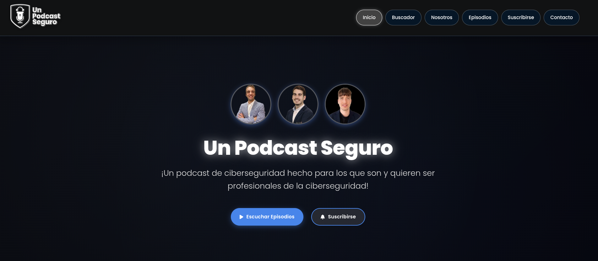
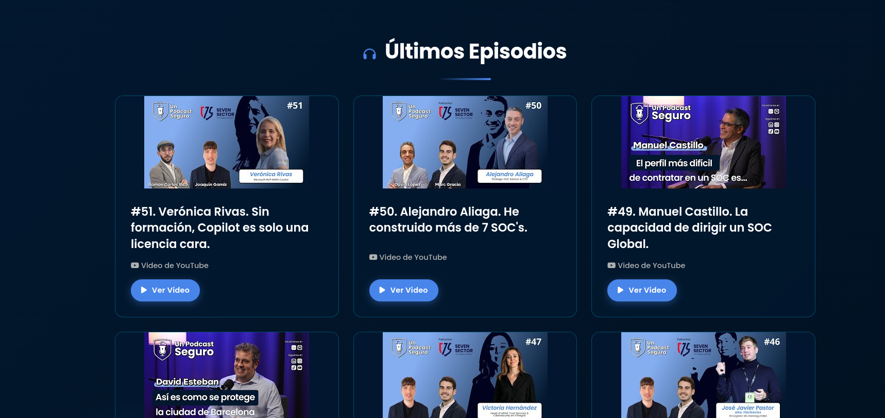
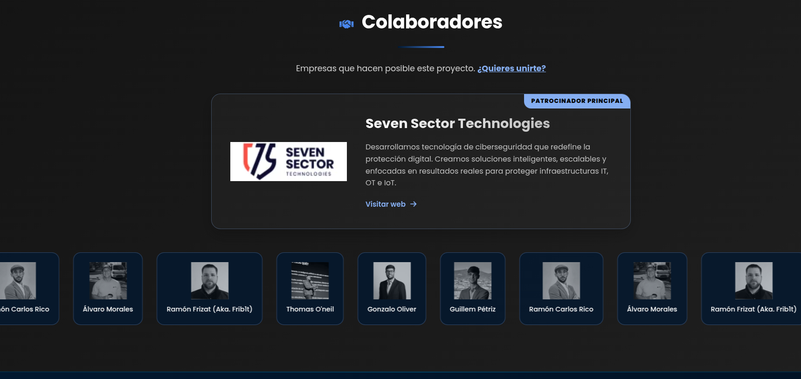

# 🎙️ Un Podcast Seguro - Web App & AI Chatbot

> **La plataforma web oficial del podcast líder en ciberseguridad, hacking ético y seguridad informática en español.**



Esta aplicación web no solo sirve como catálogo para los episodios de "Un Podcast Seguro", sino que integra un **potente buscador basado en Inteligencia Artificial** que permite a los usuarios interactuar con el conocimiento acumulado de todos los invitados.

---

## ✨ Características Principales

### 🧠 Buscador IA (RAG + Gemini)
Interactúa con nuestro chatbot experto en ciberseguridad. Gracias a la integración con **Google Gemini 1.5 Flash** y una base de datos vectorial (FTS5):
- **Búsqueda Semántica:** Entiende el contexto de tu pregunta, no solo palabras clave.
- **Acceso Total:** Tiene indexadas las transcripciones completas de todos los episodios.
- **Respuestas Precisas:** Cita las fuentes exactas y el minuto aproximado del episodio.
- **Contexto Global:** Conoce a todos los invitados y temáticas tratadas.

### 🎨 Diseño Premium (Glassmorphism)
Una interfaz moderna y oscura diseñada para una experiencia inmersiva:
- **Estética Cyberpunk/Tech:** Fondos oscuros, neones y transparencias.
- **Animaciones Suaves:** Transiciones fluidas y efectos de hover.
- **Totalmente Responsivo:** Adaptado para móviles, tablets y escritorio.



### 🔄 Sincronización Automática
El sistema se mantiene siempre actualizado sin intervención manual:
- **Sync Script:** Un proceso en segundo plano verifica el canal de YouTube cada 6 horas.
- **Descarga de Transcripciones:** Usa `yt-dlp` para bajar y procesar subtítulos automáticamente.
- **Indexación en Vivo:** Los nuevos episodios se añaden al buscador IA al instante.

### 👥 Gestión de Colaboradores
Sección dedicada a los expertos y empresas que hacen posible el proyecto.



---

## 🛠️ Tech Stack

- **Backend:** Python (Flask), SQLite (FTS5).
- **Frontend:** HTML5, CSS3 (Variables, Flexbox/Grid), JavaScript (Vanilla).
- **AI & Data:** Google Generative AI (Gemini), RAG (Retrieval-Augmented Generation).
- **Tools:** `yt-dlp` (YouTube Data), `apscheduler` (Tareas programadas).

---

## 🚀 Instalación y Despliegue

### Prerrequisitos
- Python 3.10+
- `ffmpeg` (para el procesamiento de audio/video si fuera necesario)
- Una API Key de Google Gemini (Gratuita).

### 1. Clonar el repositorio
```bash
git clone https://github.com/tu-usuario/unpodcastseguro.git
cd unpodcastseguro
```

### 2. Configurar Entorno
Crear un entorno virtual para aislar las dependencias:
```bash
python -m venv venv
source venv/bin/activate  # En Linux/Mac
# venv\Scripts\activate   # En Windows
```

Instalar dependencias:
```bash
pip install -r requirements.txt
```

### 3. Variables de Entorno
Crea un archivo `.env` en la raíz del proyecto basándote en `.env.example`:

```ini
# .env
GEMINI_API_KEY=tu_api_key_aqui
FLASK_ENV=development
```

### 4. Inicializar Datos
Si es la primera vez, ejecuta el script de sincronización para poblar la base de datos:
```bash
python scripts/sync_transcripts.py
```
*Esto descargará los últimos 1000 videos y sus transcripciones.*

### 5. Ejecutar (Desarrollo)
```bash
python run.py
```
La aplicación estará disponible en `http://localhost:5000`.

### 6. Permisos y Servicios (Producción)
Para entornos de producción (Apache/Systemd), aplica los siguientes comandos:
```bash
sudo chown -R www-data:www-data /var/www/unpodastseguro/
sudo find /var/www/unpodastseguro -type d -exec chmod 755 {} \;
sudo find /var/www/unpodastseguro -type f -exec chmod 644 {} \;
sudo chmod 775 /var/www/unpodastseguro
sudo chmod 664 /var/www/unpodastseguro/db.*
sudo chmod +x /var/www/unpodastseguro/venv/bin/uvicorn
sudo systemctl restart apache2
sudo systemctl restart unpodastseguro.service
```

---

## 📂 Estructura del Proyecto

```
unpodcastseguro/
├── backend/                # Lógica del servidor
│   ├── blueprints/        # Rutas (API, Vistas)
│   ├── ai.py              # Lógica del Chatbot (RAG)
│   └── config.py          # Configuración
├── database/               # Almacenamiento
│   ├── transcripts/       # Archivos de texto sin procesar
│   └── usuarios.db        # Base de datos SQLite (Usuarios + FTS)
├── static/                 # Assets (CSS, JS, Imágenes, JSON)
│   ├── css/               # Estilos (home.css, buscador.css)
│   ├── data/              # Metadatos (videos.json, colaboradores.json)
│   └── images/            # Recursos gráficos
├── templates/              # Plantillas HTML (Jinja2)
├── scripts/                # Herramientas de mantenimiento
└── run.py                  # Entry point
```

---

## 🤝 Contribuir

¡Las contribuciones son bienvenidas! Por favor, abre un issue o envía un pull request para mejoras.

1. Haz un Fork del proyecto.
2. Crea una rama para tu feature (`git checkout -b feature/AmazingFeature`).
3. Commit de tus cambios (`git commit -m 'Add some AmazingFeature'`).
4. Push a la rama (`git push origin feature/AmazingFeature`).
5. Abre un Pull Request.

---

## 📄 Licencia

© 2026 Un Podcast Seguro. Todos los derechos reservados.